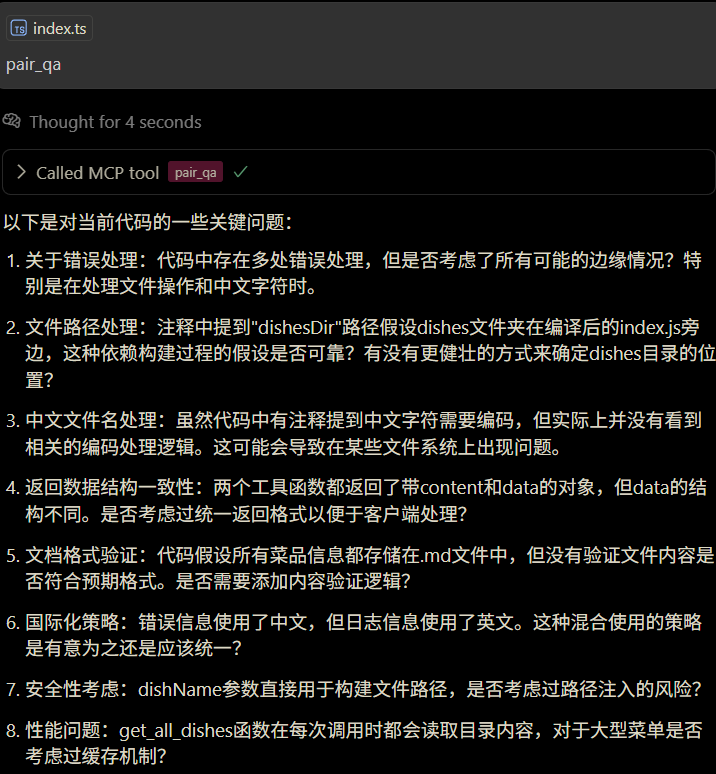

# coco

一个开发者的小帮手

## 安装

```json
{
  "mcpServers": {
    "coco": {
      "command": "npx",
      "args": ["mcp-coco"]
    }
  }
}
```

## 功能

### pair-qa

代码审查, 获取相关的上下文, 就像是结对编程中你的搭档一样, 他会向你提出问题, 你来回答, 直到你认为代码已经足够好


